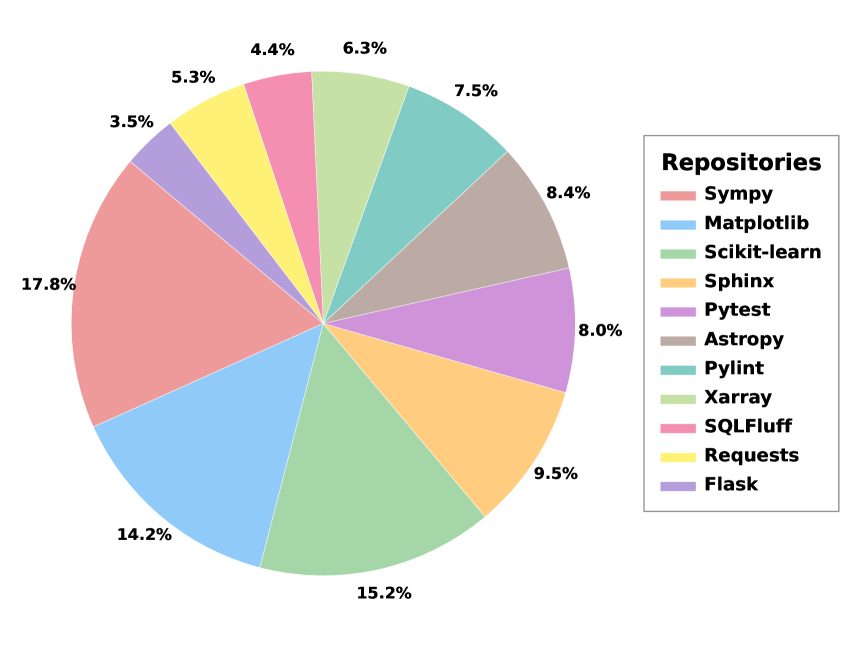
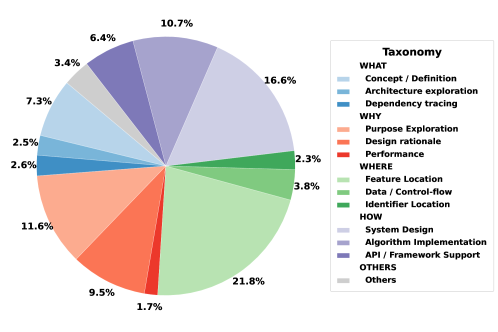
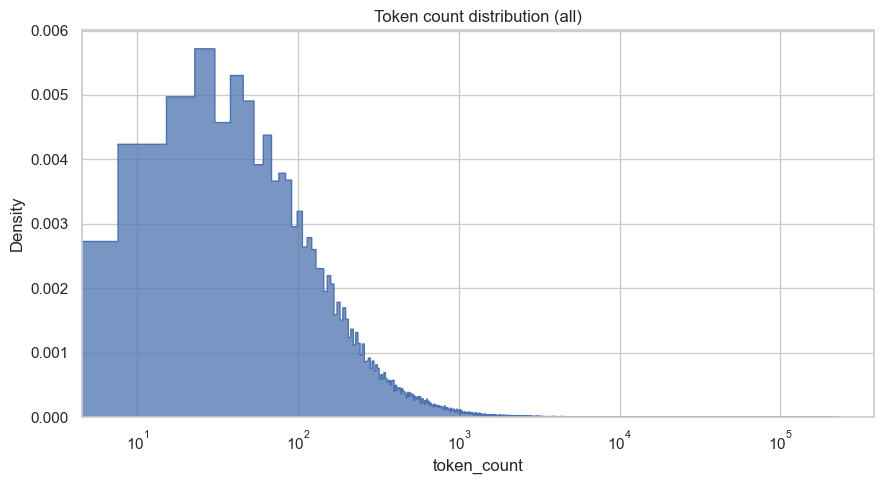
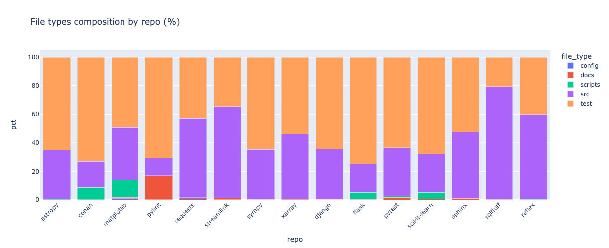
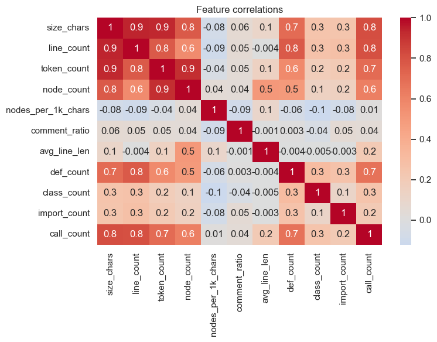
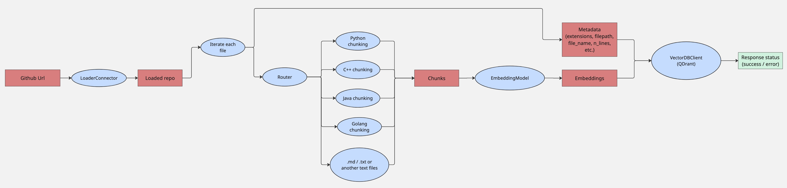
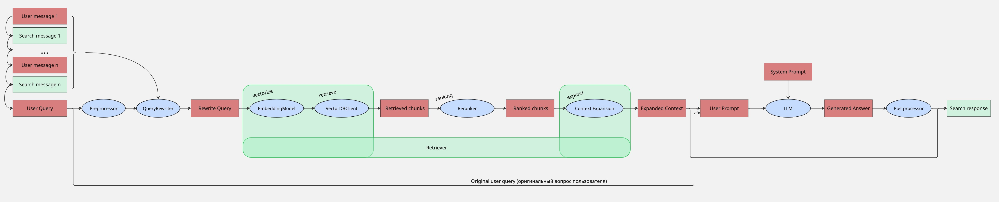
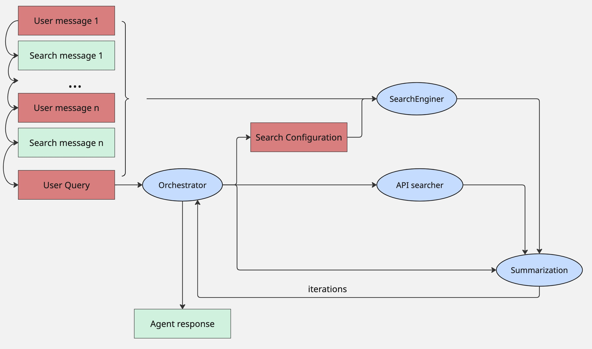

# RAG4Code: OpenSource Framework for Codebase Q&A

[](https://opensource.org/licenses/MIT)
[](https://www.python.org/downloads/)

**RAG4Code** — это OpenSource фреймворк, предназначенный для семантического поиска и ответов на вопросы по кодовой базе GitHub-репозиториев. Решение объединяет классический RAG, агентный подход и гибкую настройку пайплайнов поиска.

## 0. Быстрый старт

### 0.1 Установка и запуск

Прежде всего необходимо склонировать репозиторий:
```bash
git clone https://github.com/KonstFed/RAGCore.git
```

Также необходимо установить Docker на систему.

Дальше вы можете использовать готовый Docker-Compose файл, либо установить все зависимости вручную.

#### 0.1.1 Docker (рекомендуемый способ)

Положить в файл docker/.env свой API ключ Openrouter/Jina (в текущей версии используется Openrouter), пример можно посмотреть в docker/.env_example

Установка зависимостей:

```bash
bash docker/build.sh
```

Запуск приложения:

```bash
bash docker/run.sh
```

В конце нужно открыть приложение в браузере по ссылке:

```
http://0.0.0.0:8501
```

Чтобы остановить приложение:
```
bash docker/stop.sh
```

#### 0.1.2 Вручную

Положить в файл .env свой API ключ Openrouter/Jina (в текущей версии используется Openrouter), пример можно посмотреть в docker/.env_example

Установка [uv](https://github.com/astral-sh/uv):

```bash
curl -LsSf https://astral.sh/uv/install.sh | sh
```

Установка зависимостей:

```bash
uv sync
```

Затем необходимо загрузить образ базы данных Qdrant:

```bash
docker pull qdrant/qdrant
```

Затем нужно в отдельном терменале запустить сервер с Qdrant:

```bash
docker run -p 6333:6333 -p 6334:6334 -v qdrant_storage:/qdrant/storage qdrant/qdrant
```

И затем запустить приложение:

```bash
streamlit run app.py
```

В конце нужно открыть приложение в браузере по ссылке:

```
http://0.0.0.0:8501
```

Чтобы остановить приложение нужно остановить нажать CTLR + C и остановить контейнер с Qdrant:
```
docker stop <qdrant_container_id> (id можно посмотреть с помощью команды docker ps)
```

### 0.2 Пример использования


## 1. Данные

В качестве источника данных был выбран публичный бенчмарк [SWE-QA-Bench](https://github.com/peng-weihan/SWE-QA-Bench/). В него включены 15 популярных Python-репозиториев, охватывающих различные типы проектов:

<details>
  <summary>Список репозиториев:</summary>

        - Astropy
        - Django
        - Flask
        - Matplotlib
        - Pylint
        - Pytest
        - Requests
        - Scikit-learn
        - Sphinx
        - Sqlfluff
        - Sumpy
        - Xarray
        - Conan
        - Reflex
        - Steamlink
</details>


### 1.1. Процесс подготовки данных

Для каждого репозитория была выполнена загрузка исходного кода и автоматическая обработка. Парсер обходит все файлы репозитория, исключает файлы и директории согласно конфигурации (параметр `exclude`), и обрабатывает только поддерживаемые типы файлов (параметр `ast_chunker_languages`).
Все файлы с кодом разбиваются с использованием AST-чанкинга: каждая функция или класс выделяются в отдельный чанк.
Для остальных файлов применяется нарезка по строкам (100 строк с перекрытием 20).
Каждый чанк содержит сырой текст и метаданные: путь к файлу, имя файла, диапазон строк, язык, размер в количестве символов и уникальный идентификатор.

<details>
  <summary>Пример чанка:</summary>

    [
      {
        "content": "def pytest_configure(config):\n    PYTEST_HEADER_MODULES[\"PyERFA\"] = \"erfa\"\n    PYTEST_HEADER_MODULES[\"Cython\"] = \"cython\"\n    PYTEST_HEADER_MODULES[\"Scikit-image\"] = \"skimage\"\n    PYTEST_HEADER_MODULES[\"pyarrow\"] = \"pyarrow\"\n    PYTEST_HEADER_MODULES[\"asdf-astropy\"] = \"asdf_astropy\"\n    TESTED_VERSIONS[\"Astropy\"] = __version__",
        "metadata": {
            "chunk_id": "b46ec686-da54-4613-8bb1-496dd64ae6b7",
            "filepath": "conftest.py",
            "file_name": "conftest.py",
            "chunk_size": 328,
            "line_count": 7,
            "start_line_no": 22,
            "end_line_no": 28,
            "node_count": 46,
            "language": "python"
        }
      },
      ...
    ]

</details>

Все репозитории были проиндексированы таким образом и собраны в единый датасет, который имеет таку структуру:
```
SWE-QA-Bench-Dataset/
├── chunks/
│   ├── astropy.json
│   ├── django.json
│   ├── ...
├── questions/
│   ├── astropy.jsonl
│   ├── ...
├── repos/
    ├── astropy/
        ├── ...
    ├── ...
```

Данные структурированы и сохранены на [Яндекс Диск](https://disk.yandex.ru/d/hcGLPoNdE8l9hQ).

### 1.2. Анализ данных

Статистика:
- всего: **80,710** чанков и **705** вопросов (по **47** вопросов на каждый репозиторий)
- менее **0,05%** всех строк - это комментарии и документация
- больше всего чанков относятся к типу **test**, **src** и **scripts**, затем **docs** и **config**
- более 95% всех чанков относяткся к **Python**, однако так же имеется **JavaScript** и **C++**

<details>
  <summary>Графики и диаграммы:</summary>

  Distribution of collected issues | Distribution of question types
  :-------------------------:|:-------------------------:
    |  

  

  

  

  
</details>


## 2. Описание архитектуры

RAG4Code состоит из 3-х компонент:
  - Data Enrichment
  - Search Engine
  - Agentic

### 2.1. Пайплайн индексации репозиториев (Data Enrichment)
Пайплайном индексации репозитория управляет класс `Data Enrichment`. Весь pipeline состоит из последовательного взаимодействия нескольких модулей: `LoaderConnector` - скачивает сам репозиторий, `Parser` - обходит репозиторий и обрабатывает нужные файлы из него, нарезая на чанки, и `Vectorizer` - векторизует с помощью модели эмбеддера чанки. Результат работы индексатора сохраняется в векторную базу `Qdrant`.

Полный pipeline работы индексатора представлен ниже:


### 2.2. Пайплайн поиска (Search Engine)
Пайплайном поиска упарвляет класс `Search Engine`, который состоит из нескольких последовательно идущих модулей, сердцем является модуль `Retriever`. Модуль способен обрабатывать как одиночный запросы пользователя, так и поддерживает обработку истории диалога с пользователем с помощью модуля `QueryRewriter`.

Модуль ранжирования `Reranker` позволяет переранжировать найденные источники и отфильтровать совсем нерелевантные. Модуль расширения контекста `Context Expansion` позволяет расширить контекст перед передачей в `LLM`.

Полный pipeline работы поиска представлен ниже:


### 2.3. Пайплайн агентского сценария (Agentic)
Агентский сценарий позволяет декомпозировать запрос пользователя, настраивать конфигурацию поиска, ходить в открытое API для получения актуальной информации по необходимым пакетам и библиотекам, а также агрегировать и суммаризировать итоговый результат каждого модуля. Так же агент способен оценивать качество выполнения всего процесса и, при необходимости, повторять запросы с другими параметрами, пока не будет получен удовлетворяющий агента ответ или не закончатся лимит на итерации.

Полный pipeline работы агента представлен ниже:


Управление зависимостями осуществляется через пакетный менеджер - [uv](https://github.com/astral-sh/uv), список зависимостей доступен по - [ссылке](uv.lock).


## 3. Процесс тестирования

Процесс тестирования состоит из двух этапов:
  - Проверка работы Search Engine
  - Проверка работы Agentic

### 3.1. Тестирование Search Engine
В рамках тестирования классического поиска формируется стандартная конфигурация поиска для всех репозиториев, и прогоняются все тестовые вопросы с этой стандартной конфигурацией. Результатом работы служит сгенерированный LLM ответ (`answer`), а так же найденные в процессе поиска контексты (`sources`).

### 3.2. Тестирование Agentic
В рамках тестирования агентского сценария формируется стандартная конфигурация агента для всех репозиториев, и прогоняются все тестовые вопросы с этой стандартной конфигурацией. Результатом работы служит сгенерированный финальный ответ от LLM (`answer`), найденные в процессе поиска контексты (`sources`), а так же сохраняется история вызова тулов агента вместе с `reasoning`.

### 3.3. Метрики качества
Так как выбранный бенчмарк не позволяет скриптово оценить точность поиска (в бенчмарке отсутствует привязка вопроса к конкретным файлам/строкам/классам и т.д.), то единственным вариантом оценки поиска является подход LLM-as-judge `Context Relevance` с бинарной оценкой: где 0 - источник не позволяет даже частично ответить на вопрос, а 1 - источник полностью или частично позволяет ответить на заданный вопрос.

Для оценки генеративного ответа и роутинга оркестратора в агентском сценарии будет использован так же подход LLM-as-judge `Quality/Correctness` с 5-ти бальной оценкой: где 0 - ответ совершенно неправильный и неполный, а 5 - ответ правильный и полный.
